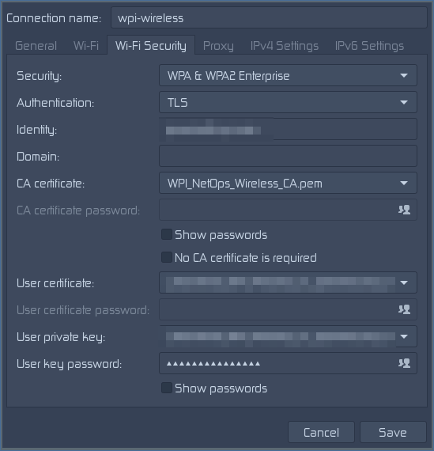

# Arch Linux WPI Wireless Configuration
This repository contains an automated script to configure Arch Linux to connect to WPI's Wireless Network, as well as manual connection instructions. 

## Preparation
Whether connection to WPI WiFi manually or through the automated script, you should walk through the next three sections to make sure your system is ready. 

#### 1) About WPI's WiFi
WPIs wireless network is based on WPA2 Enterprise security. This means that it encrypts traffic using public and private keys. Unfortunately, WPI does not provided useful utilities/instructions on how to connect to its network from *unconventional operating systems*, such as Arch Linux. This is where this guide comes in.

#### 2) Install and Enable NetworkManager
This guide is designed to configure NetworkManger to connect to WPI's WiFi. Networkmanager can be installed and enabled with the following commands:
```bash
sudo pacman -S networkmanager
sudo systemctl enable NetworkManager
```
Enabling NetworkManger will ensure that it starts each time your machine is booted up.

#### 3) Connect to Initial Network
In order to download the necessary certificates, you will need an initial network connection. If you are on campus, you can connect to WPI-Open with the following command:
```bash
nmcli dev wifi connect WPI-Open
```

## Automated Wireless Configuration
This repository includes a script designed to make connecting to WPI's WiFi a streamlined process. This script works as of 2018; however, if WPIs Network Operations change configuration details related to the wireless network it may break the script. Thus if you find that the automated approach does not work for you, please proceed to the manual configuration section.

#### 1) Script Dependencies
This script requires python2 and the python2 mechanize library; both can be installed as follows:
```bash
sudo pacman -S python2
sudo pacman -S python2-mechanize
```

#### 2) Script Execution
To run this script, execute:
```bash
python2 install.py
```
It will prompt you to enter your WPI Username, WPI Password, confirm WPI's Acceptable Use Policy, and eventually enter your root password so that a few commands can be run as root. Note, do not execute the entire script as root. 

#### 3) Connect
I Before connecting, NetworkManager must be restart. 
```bash
sudo systemctl restart NetworkManager
```
To connect, within a terminal run the following command:
```bash
nmcli c up wpi-wireless
```
At this point you should be successfully connected to the network. In the future, network manager should automatically try to connect to this network; if you have issues with network Manager automatically connecting to WPI-Open instead of WPI-Wireless, you can delete the WPI-Open profile by running:
```bash
sudo rm /etc/NetworkManager/system-connections/WPI-Open
```

## Manual Wireless Configuration
If you'd prefer to manually configure your system to connect to WPI's wireless network, It can be done in three steps. Please note that manual installation requires a Window Manager/Desktop Environment, a Web Browser, and nm-connection-editor (the NetworkManager gui front end).

#### 1) Download CA Certificates
Navigate to https://wpi-wireless-setup.wpi.edu/enroll/WPI/Production/process in a web browser and follow the on screen instructions until you reach the page that says *Download for Linux*. Unfortunately WPI's automated installer only works for Ubuntu and Fedora, hence why the network needs to be configured manually. At the bottom left of the page, click *Show all Operating Systems*, and open the *Other Operating Systems* tab. Under *Step 1: Install The CA Certificate* click the *PEM* link; this will download the public certificate. Next, click  *Step 2: Install Your Certficate* to download the private certificate.

#### 2) Install CA Certificates
Installing the CA Certificates must be done within a terminal. To begin, move the public certificate to the directory '/etc/ca-certificates/trust-source/anchors/'. If this directory does not exist create it first. This can be done with the following commands (Note: Your certificate file name may be different):
```bash
sudo mkdir -p /etc/ca-certificates/trust-source/anchors/
sudo mv ~/Downloads/CA-3905B39901F24AD1293BEE10EC9A67703B61834E.pem /etc/ca-certificates/trust-source/anchors/ 
```
Next, to install the public certificate run:
```bash
sudo trust extract-compat
```
Finally you should move your private certificate to a permanent location. This could be done in the following way:
```bash
mkdir -p ~/.ca-certificates
mv ~/Downloads/certificate.p12 ~/.ca-certifcates/
```

#### 3) Create NetworkManager Profiles
Open the NetworkManager front end by running: 
```bash
nm-connection-editor
```
In the bottom left of the applet click the plus button and select WiFi to create a new profile. Configure the WiFi tab to look as follows. Note your *Device* (WiFi interface and MAC address) will be specific to your system (blurred out in image):


Next, Configure the WiFi-Security tab to look as follows. Note, your *identity* is your wpi email address, the *CA-Certificate* is the extracted public certificate (located at /etc/ca-certificates/extracted/cadir/WPI_NetOps_Wireless_CA.pem), the *user certificate* and *user private key* are the private certificate (located where stored in part 2), and the *user key password* is your WPI password. 



Repeat this step to create a profile for the eduroam network. 

#### 4) Connect
I Before connecting, NetworkManager must be restart. 
```bash
sudo systemctl restart NetworkManager
```
To connect, within a terminal run the following command:
```bash
nmcli c up wpi-wireless
```
At this point you should be successfully connected to the network. In the future, network manager should automatically try to connect to this network; if you have issues with network Manager automatically connecting to WPI-Open instead of WPI-Wireless, you can delete the WPI-Open profile by running:
```bash
sudo rm /etc/NetworkManager/system-connections/WPI-Open
```
